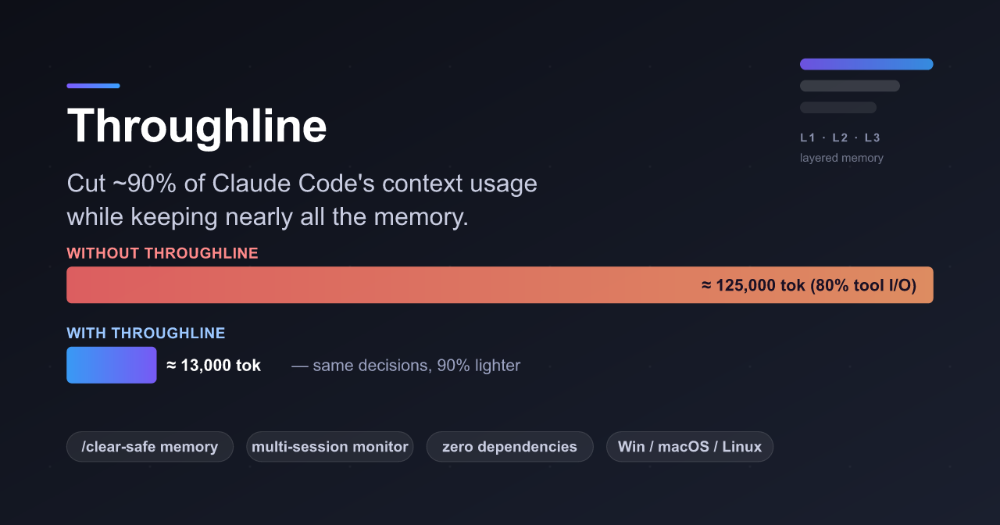
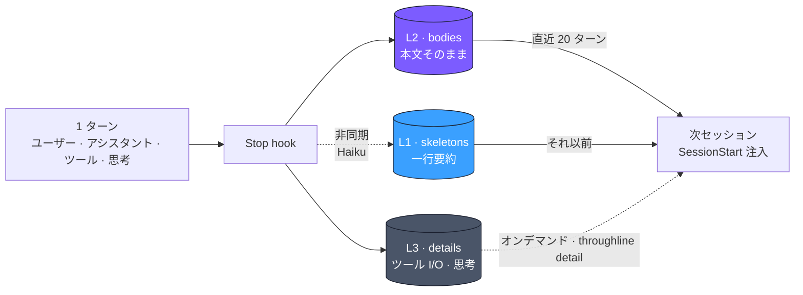

<p align="center">
  
</p>

# Throughline

[](https://www.npmjs.com/package/throughline)
[](LICENSE)
[](https://nodejs.org)
[](https://github.com/kitepon-rgb/Throughline/actions/workflows/test.yml)

[English](README.md) · **日本語**

> **Claude Code のコンテキスト消費を約 90% 削減しつつ、記憶はほぼそのまま残す。**
> 「時間の新旧」ではなく **「コンテンツの種類」** で会話を分離する。人間が読みたいテキストは残し、機械が出力したツール I/O は SQLite に退避する。同じ判断、同じ文脈、9 割軽量。

## 30 秒で始める

```bash
npm install -g throughline
throughline install     # ~/.claude/settings.json に hook を登録
```

これだけ。Claude Code のセッションを開けば、以後すべてのターンが
`~/.throughline/throughline.db` に自動で流れていく。50 ターン作業した後、
次のセッションへ記憶を引き継ぎたければ `/clear` の前に `/tl` を打つ。新セッションは
ゼロからのスタートではなく、**思考の途中から再開** される。

## 他の手段との比較

| | Throughline | MemGPT / SummaryBufferMemory | 素の Claude Code |
|---|---|---|---|
| **圧縮の軸** | コンテンツの **種類** (テキスト vs ツール I/O) | **新旧** (古い → 要約) | 無し |
| **コーディング用途への適合** | 高 — ツール I/O こそ重い 80% | 中 — 残したい部分まで圧縮される | — |
| **`/clear` 後の生存** | ✅ SQLite + `/tl` バトン | ホスト依存 | ❌ |
| **誤継承リスク** | ゼロ (明示的な `/tl`) | 高 | — |
| **ランタイム依存** | **ゼロ** (Node 22.5+ 同梱の `node:sqlite`) | 多数 | — |
| **マルチセッション トークン監視** | ✅ 実測 `message.usage`、`len/4` 推定なし | — | — |

<details>
<summary><b>なぜこれが効くのか — 80% ツール I/O 問題</b></summary>

通常の Claude Code セッションでは、**コンテキストの 80% はツール I/O** です —
ファイル読み込み、Bash 出力、grep 結果。これらは Claude が即座に消費するデータですが、
コンテキスト上には永久に残り、ウィンドウ上限に向かって押し出されていきます。

Throughline はこの問題を、会話を **時間ではなく種類** で分離することで解決します:

```
Throughline 無し (50 ターン、/clear なし):
  コンテキスト = ユーザー文 + アシスタント文 + ツール I/O + システムメッセージ
              ≈ 125,000 トークン (うち 80% は二度と読み返さないツール I/O)

Throughline 有り (50 ターン → /clear → 再開):
  コンテキスト = 直近 20 ターンの会話本文 (L2)
              + それ以前 30 ターンの一行要約 (L1)
              + ツール I/O ゼロ (L3 — SQLite に退避、必要時にだけ取得)
              ≈ 13,000 トークン — 同じ判断、同じ文脈、90% 軽量
```

MemGPT や LangChain の SummaryBufferMemory が **新旧** で圧縮するのに対し、
Throughline は **コンテンツの種類** で分離します。人間が読むべき会話は残し、
機械が生成した一過性のツール出力は退避する。コーディングアシスタント向けに
特化した設計です。

退避された L3 は失われていません。過去ターンのツール出力が再び必要になれば、
Claude は `throughline detail <時刻>` で取り戻せます。

Throughline は加えて、トランスクリプト JSONL から実測 API 使用量を読む
**マルチセッション トークン監視ツール** も同梱しています (`length / 4` 推定は使いません)。

</details>

---

## 3 層メモリーモデル (schema v7)



| 層 | 名称 | 保存先 | 内容 | ターンあたりコスト |
| --- | --- | --- | --- | --- |
| **L1** | スケルトン | 古いターンとして注入 | Haiku が生成する一行要約 | 約 10 トークン |
| **L2** | ボディ | 直近ターンとして注入 | ユーザー本文 + アシスタント返答そのまま | 自然なフルサイズ |
| **L3** | ディテール | SQLite のみ | ツール I/O、システムメッセージ、画像、**拡張思考** (オンデマンド) | 重い、退避済 |

3 層は **互いに補完的かつ排他的** で、重複保存はありません。
拡張思考ブロックは L3 (`kind='thinking'`) に格納されるので、次セッションは
**前セッションの Claude が中断時に何を考えていたか** を、発話だけでなく
内省レベルで参照できます。`SessionStart` では **最終ターンの思考** が L2 履歴の
直上にインライン注入され、それ以前の思考は `throughline detail <時刻>` で取得できます。

`SessionStart` 時、Throughline は SQLite からコンテキストを再構築し、
プレーンテキストとして注入します:

- **直近 20 ターン** は L2 (`bodies`) のフル本文として注入
- **それ以前** は L1 (`skeletons`) の一行要約として注入
- L3 は SQLite に残り、`/sc-detail <時刻>` でオンデマンド取得

L1 要約は `claude -p --model claude-haiku-4-5-*` サブプロセスで
**Claude Haiku 4.5** が生成します。Claude Max のログイン認証を流用するため
API キー不要です。要約は遅延実行で、20 ターン未満で終わるセッションでは
Haiku は一度も呼ばれず、短いタスクの要約コストはゼロです。

3 層 (L1/L2/L3) の書き込みパスは schema v5 から動作しています。
`/sc-detail HH:MM:SS` はユーザー / アシスタント本文 (L2) と、そのターンで
L3 に保存された `kind` 別 (ツール入力 / ツール出力 / hook 出力) を返します。

---

## 明示的引き継ぎ — `/tl` (in-flight メモ付き)

引き継ぎは **明示的** であり、自動ではありません。次セッションへ「ここから続けてほしい」と
渡したいときは、現セッションで `/clear` または新規チャットを開く **前に** `/tl` を打ちます。
`/tl` 無しの場合、新セッションはまっさらな状態で始まり、過去メモリは引き継がれません。

`/tl` は 2 つの仕事をします:

1. **引き継ぎバトンの書き込み**。現在の `session_id` を `handoff_batons` テーブルへ、
   `UserPromptSubmit` hook 経由で記録します。
2. **現 Claude に in-flight メモを書かせる**。`/tl` は Claude に対し、
   *次に何をしようとしていたか、現在の仮説、未解決の問い、進行中 TODO* を Markdown で
   要約し、`throughline save-inflight` 経由でバトンの `memo_text` カラムに添付するよう
   指示します。これにより、トランスクリプト再生だけでは保てない「いま考え中だった内容」を保存できます。

次の `SessionStart` では、hook がバトンを読み、**1 時間以内** であれば
そのセッションのメモリを `BEGIN IMMEDIATE` トランザクション内で
`UPDATE session_id = ?` を使って決定論的にマージします。バトンはマージと
原子的に消費 (削除) されるため、二重発火しません。注入される再開コンテキストは
**「中断されたタスクの再開」** として再フレーミングされ、in-flight メモと最終ターンの
拡張思考が先頭に来ることで、新 Claude は思考の途中から拾えます。

```
Session A (/tl を打つ)  -----------> バトン書き込み
                                          |
                          /clear           |
                             |             ▼
                          Session B  ---- バトン読込 → A を B にマージ → バトン削除 ---->
                             |
                          (もう一度 /tl で更に渡せる)
```

明示的バトン方式を選んだ理由:

- **誤継承ゼロ**。並行ウィンドウや VSCode 再起動、同じリポジトリでの新規タスクが、
  前セッションのメモリを誤って引き継ぐことはありません。`/tl` 明示時のみ発火。
- **VSCode 拡張対応**。`SessionStart` hook の `source` フィールドは VSCode 拡張で
  `/clear` 後も `"startup"` に書き換えられてしまう
  ([issue #49937](https://github.com/anthropics/claude-code/issues/49937))。
  source 判定は信用できないため、ユーザー駆動のバトンで回避。
- **決定論的**。時間窓ヒューリスティック、PID 推測、祖先プロセス追跡なし。
  ユーザーが意思を宣言し、hook が実行する。それだけ。

各マージ行は `origin_session_id` を保持するので、`/tl` を繰り返すと
記憶がチェーン状に蓄積します:

```
S1 (4 ターン) --/tl,/clear--> S2 (S1 をマージ + 3 ターン追加) --/tl,/clear--> S3 (S2 をマージ + 5 ターン追加)
                              origin=S1×4                                    origin=S1×4, S2×3, S3×5
```

---

## マルチセッション トークン監視

実行:

```bash
throughline monitor            # 現プロジェクトのアクティブな全セッション
throughline monitor --all      # 全プロジェクト、全セッション
throughline monitor --session <id-prefix>
```

実機出力例 (1M context Opus セッション稼働中):

```
[Throughline] 1 セッション
▶ Throughline       2ed5039c  ████░░░░░░░░░░░░░░░░  205.1k /  21%  残 794.9k  claude-opus-4-6
```

詳細仕様 (resize 追従、1M context 検出、ステイル隠し、Stop hook の非同期化など) は
[英語版 README](README.md#multi-session-token-monitor) を参照してください。

---

## コマンド早見表

| コマンド | 役割 |
| --- | --- |
| `throughline install` | `~/.claude/settings.json` (ユーザー全体) に hook を登録 |
| `throughline install --project` | 現リポジトリの `.claude/settings.json` だけに hook を登録 |
| `throughline uninstall` | hook を削除 |
| `throughline monitor` | マルチセッション監視を起動 |
| `throughline monitor --diag` | TTY/columns/env 診断ダンプ (描画バグ切り分け用) |
| `throughline detail <時刻>` | あるターンの L2 本文と L3 ツール I/O を取得 (Claude が使う) |
| `throughline save-inflight` | `/tl` から呼ばれ、現バトンに in-flight メモを添付 (stdin 経由) |
| `throughline doctor` | Node バージョン、hook 登録状況、DB、PATH をチェック |
| `throughline doctor --session <id-prefix>` | 特定セッションの state/transcript ズレを診断 |
| `throughline status` | DB 統計表示 (sessions / skeletons / bodies / details) |
| `throughline --version` | インストール済みバージョンを表示 |

スラッシュコマンド (Claude Code 内でユーザーが叩く):

| コマンド | 役割 |
| --- | --- |
| `/tl` | 引き継ぎバトンを書き込み + Claude に in-flight メモを書かせる |
| `/sc-detail <時刻>` | 過去ターンの L2 本文と L3 ツール I/O を取得 |

> `/tl` 発火時、Claude は Bash 経由で `throughline save-inflight` を呼びます。
> 初回は許可確認が出るので、`Bash(throughline save-inflight:*)` を allowlist に
> 追加すると以後の確認はスキップできます。

---

## 動作要件

- **Node.js 22.5 以上** (組み込み `node:sqlite` モジュール使用、ネイティブビルド不要)
- **Claude Code** (`SessionStart`, `Stop`, `UserPromptSubmit` hooks 対応版)
- **Claude Max サブスクリプション** (Haiku ベース L1 要約のため `claude -p` 経由)
- 対応 OS: **Windows / macOS / Linux**

ランタイム依存 **ゼロ**。npm パッケージは純 `.mjs` ファイルのみで構成されています。

---

## 設計ドキュメント

- [`docs/L1_L2_L3_REDESIGN.md`](docs/L1_L2_L3_REDESIGN.md) — L1/L2/L3 差分階層モデルの **設計仕様書** (schema v4 ベース + v5 L3 分類拡張)。記憶階層化ルールの正典
- [`docs/INHERITANCE_ON_CLEAR_ONLY.md`](docs/INHERITANCE_ON_CLEAR_ONLY.md) — `/tl` バトン引き継ぎ方式の設計判断記録 (schema v6–v7)
- [`docs/PUBLIC_RELEASE_PLAN.md`](docs/PUBLIC_RELEASE_PLAN.md) — 公開配布化プラン、§ 0 フォールバック禁止ルール、バージョン別実装ステータス
- [`CHANGELOG.md`](CHANGELOG.md) — リリース履歴
- [`docs/archive/`](docs/archive/) — 破棄済み旧設計 (CONCEPT 初期案、session-linking 実験記録など)

---

## ライセンス

MIT — [LICENSE](LICENSE) 参照。
