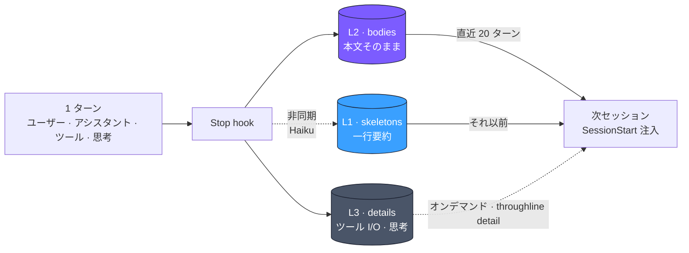

<p align="center">
  
</p>

# Throughline

[](https://www.npmjs.com/package/throughline)
[](LICENSE)
[](https://nodejs.org)
[](https://github.com/kitepon-rgb/Throughline/actions/workflows/test.yml)

[English](README.md) · **日本語**

> **Claude Code のコンテキスト消費を約 90% 削減しつつ、記憶はほぼそのまま残す。**
> 「時間の新旧」ではなく **「コンテンツの種類」** で会話を分離する。人間が読みたいテキストは残し、機械が出力したツール I/O は SQLite に退避する。同じ判断、同じ文脈、9 割軽量。

## 30 秒で始める

```bash
npm install -g throughline
throughline install     # hook / Codex skill / VS Code monitor task を登録
```

これだけ。Claude Code のセッションを開けば、以後すべてのターンが
`~/.throughline/throughline.db` に自動で流れていく。50 ターン作業した後、
`/clear` を打てば新セッションはゼロからではなく、**思考の途中から再開** される。
`/clear` を経由しない新規 chat / VS Code 再起動では `/tl` で前任を指名できる。

Codex では `UserPromptSubmit` / `PostToolUse` / `Stop` hook と `$throughline`
skill も登録する。80% 自動発火は token-monitor 依存ではなく、当該 Codex
セッションの rollout `token_count` を hook が読み、prompt 送信時または tool loop
途中の閾値到達時に同じセッションへ `$throughline` 実行指示を注入する。

## 他の手段との比較

| | Throughline | MemGPT / SummaryBufferMemory | 素の Claude Code |
|---|---|---|---|
| **圧縮の軸** | コンテンツの **種類** (テキスト vs ツール I/O) | **新旧** (古い → 要約) | 無し |
| **コーディング用途への適合** | 高 — ツール I/O こそ重い 80% | 中 — 残したい部分まで圧縮される | — |
| **`/clear` 後の生存** | ✅ SQLite + typed `/clear` / `/tl` バトン | ホスト依存 | ❌ |
| **誤継承リスク** | 低 (typed `/clear` / `/tl` が前任を指名) | 高 | — |
| **ランタイム依存** | **ゼロ** (Node 22.5+ 同梱の `node:sqlite`) | 多数 | — |
| **マルチセッション トークン監視** | ✅ Claude 実測 `message.usage`、Codex rollout `token_count` | — | — |

<details>
<summary><b>なぜこれが効くのか — 80% ツール I/O 問題</b></summary>

通常の Claude Code セッションでは、**コンテキストの 80% はツール I/O** です —
ファイル読み込み、Bash 出力、grep 結果。これらは Claude が即座に消費するデータですが、
コンテキスト上には永久に残り、ウィンドウ上限に向かって押し出されていきます。

Throughline はこの問題を、会話を **時間ではなく種類** で分離することで解決します:

```
Throughline 無し (50 ターン、/clear なし):
  コンテキスト = ユーザー文 + アシスタント文 + ツール I/O + システムメッセージ
              ≈ 125,000 トークン (うち 80% は二度と読み返さないツール I/O)

Throughline 有り (50 ターン → /clear → 再開):
  コンテキスト = 直近 20 ターンの会話本文 (L2)
              + それ以前 30 ターンの一行要約 (L1)
              + ツール I/O ゼロ (L3 — SQLite に退避、必要時にだけ取得)
              ≈ 13,000 トークン — 同じ判断、同じ文脈、90% 軽量
```

MemGPT や LangChain の SummaryBufferMemory が **新旧** で圧縮するのに対し、
Throughline は **コンテンツの種類** で分離します。人間が読むべき会話は残し、
機械が生成した一過性のツール出力は退避する。コーディングアシスタント向けに
特化した設計です。

退避された L3 は失われていません。過去ターンのツール出力が再び必要になれば、
Claude は `throughline detail <時刻>` で取り戻せます。

Throughline は加えて、トランスクリプト JSONL から実測 API 使用量を読む
**マルチセッション トークン監視ツール** も同梱しています (`length / 4` 推定は使いません)。

</details>

---

## 3 層メモリーモデル (schema v7)


```mermaid
flowchart LR
    T["1 ターン<br/>ユーザー · アシスタント · ツール · 思考"]
    T --> H["Stop hook"]
    H --> L2[("L2 · bodies<br/>本文そのまま")]
    H --> L3[("L3 · details<br/>ツール I/O · 思考")]
    H -. "非同期<br/>Haiku" .-> L1[("L1 · skeletons<br/>一行要約")]

    L2 -- "直近 20 ターン" --> S["次セッション<br/>SessionStart 注入"]
    L1 -- "それ以前" --> S
    L3 -. "オンデマンド · throughline detail" .-> S

    classDef l1 fill:#3aa0ff,stroke:#1a1f2e,color:#fff
    classDef l2 fill:#7c5cff,stroke:#1a1f2e,color:#fff
    classDef l3 fill:#4a5568,stroke:#1a1f2e,color:#fff
    class L1 l1
    class L2 l2
    class L3 l3
```

| 層 | 名称 | 保存先 | 内容 | ターンあたりコスト |
| --- | --- | --- | --- | --- |
| **L1** | スケルトン | 古いターンとして注入 | ターンの一行要約（既定は Claude Haiku、設定時は Codex sidecar も可） | 約 10 トークン |
| **L2** | ボディ | 直近ターンとして注入 | ユーザー本文 + アシスタント返答そのまま | 自然なフルサイズ |
| **L3** | ディテール | SQLite のみ | ツール I/O、システムメッセージ、画像、**拡張思考** (オンデマンド) | 重い、退避済 |

3 層は **互いに補完的かつ排他的** で、重複保存はありません。
拡張思考ブロックは L3 (`kind='thinking'`) に格納されるので、次セッションは
**前セッションの Claude が中断時に何を考えていたか** を、発話だけでなく
内省レベルで参照できます。`SessionStart` では **最終ターンの思考** が L2 履歴の
直上にインライン注入され、それ以前の思考は `throughline detail <時刻>` で取得できます。

`SessionStart` 時、Throughline は SQLite からコンテキストを再構築し、
プレーンテキストとして注入します:

- **直近 20 ターン** は L2 (`bodies`) のフル本文として注入
- **それ以前** は L1 (`skeletons`) の一行要約として注入
- L3 は SQLite に残り、`/sc-detail <時刻>` でオンデマンド取得

L1 要約は遅延実行で、20 ターン未満で終わるセッションでは外部要約器を呼ばず、
短いタスクの要約コストはゼロです。既定では
`claude -p --model claude-haiku-4-5-*` サブプロセスで **Claude Haiku 4.5** が生成します。
Claude Max のログイン認証を流用するため API キー不要です。
`codex-sidecar` が `summarize-l1` preset で明示設定されている場合は、そちらを使えます。

3 層 (L1/L2/L3) の書き込みパスは schema v5 から動作しています。
`/sc-detail HH:MM:SS` はユーザー / アシスタント本文 (L2) と、そのターンで
L3 に保存された `kind` 別 (ツール入力 / ツール出力 / hook 出力) を返します。

---

## 引き継ぎ: typed `/clear` / `/tl` が前任を指名、source-`clear` は補助

Throughline 0.4.1+ の引き継ぎは 2 経路です。主経路は typed `/clear` または
`/tl` が書く baton で、`source='clear'` の auto path は `/clear` が
UserPromptSubmit hook に届かない場合の補助です。

### baton path (primary): typed `/clear` または `/tl`

ユーザーが prompt に `/clear` または `/tl` を打つと、UserPromptSubmit hook が
**そのセッションの** `session_id` を `handoff_batons` に書きます。次の
SessionStart は 1 時間以内の baton を消費し、その前任を確定的に merge します。
複数ウィンドウで「最新更新セッション」と「今 `/clear` したセッション」が違っても、
指名された前任だけを引き継ぎます。

### auto path (fallback): `source='clear'`

baton が無く、SessionStart の `source='clear'` が届いた場合だけ、同 project の
最新 Claude predecessor を選んで merge します。これは VS Code 拡張メニューなど、
typed `/clear` が UserPromptSubmit hook に届かない経路のための補助です。

`THROUGHLINE_DISABLE_AUTO_HANDOFF=1` はこの fallback path だけを OFF にします。
typed `/clear` と `/tl` はユーザーの明示意思なので、この env に関係なく baton を
書いて引き継ぎます。

```
typed /clear: Session A → /clear → Session B (A の baton を消費して merge)
typed /tl:    Session A → /tl    → 新 chat / 再起動 → Session B (A の baton を消費して merge)
fallback:     baton 無し + source='clear' → latest predecessor を merge
```

### 注入されるもの

両経路で同じ curated memory が注入されます:

- L1 サマリー (古い turn の一行要約)
- L2 verbatim (直近 20 turn の本文)
- L3 references (`throughline detail <時刻>` で引き出すコマンド一覧、本文は SQLite に残置)

注入は **「中断されたタスクの再開」** として再フレーミングされます。L2 verbatim に
最終 assistant turn (= 次に何をしようとしていたか) が含まれるため、別途 memo /
extended thinking セクションは注入されません。

各マージ行は `origin_session_id` を保持するので、繰り返し引き継ぐと
記憶がチェーン状に蓄積します:

```
S1 (4 ターン) --/clear--> S2 (S1 を auto-merge + 3 ターン追加) --/clear--> S3 (S2 を auto-merge + 5 ターン追加)
                          origin=S1×4                                    origin=S1×4, S2×3, S3×5
```

---

## Codex sidecar と Codex trim

Throughline の主軸は引き続き **Claude Code** です。Codex 対応は、Claude hooks /
slash command / transcript / baton / resume behavior を置き換えるものではなく、
adapter / projection として追加されます。

現時点で core Throughline が外部モデルを呼ぶのは L2→L1 要約だけです。
`codex-sidecar` が `summarize-l1` preset で設定されている場合はその要約に
Codex sidecar を使えます。使えない場合は、従来どおり Claude Haiku 経路を使います。

Codex 側 trim (= same-thread context trim) は `throughline trim --execute --host codex`
で発火します。Codex の bare `$throughline` skill もこの scripted rollback + DB
memory inject を直接実行します。Claude 側は `/clear` での auto path 引継ぎが本線になったため、
`/tl-trim` slash command は v0.4.0 で廃止されました。current-work framing は
SessionStart 注入の Reading Contract / Continuation Instruction で同じ意図を
継承しています。

---

## マルチセッション トークン監視

実行:

```bash
throughline monitor            # 現プロジェクトのアクティブな全セッション
throughline monitor --all      # 全プロジェクト、全セッション
throughline monitor --session <id-prefix>
```

実機出力例 (1M context Opus セッション稼働中):

```
[Throughline] 1 セッション
▶ Throughline       2ed5039c  ████░░░░░░░░░░░░░░░░  205.1k /  21%  残 794.9k  claude-opus-4-6
```

監視中は Claude transcript / Codex rollout をライブに読み、Stop hook の state
snapshot はライブ usage が取れない場合の控えとして使います。Codex については
`~/.codex/sessions/**/rollout-*.jsonl` も直接 discovery するため、Stop hook が
Throughline state をまだ書いていない現在セッションも表示できます。Codex は open turn
中だけ `input_tokens + output_tokens` を表示し、`task_complete` 後は verified
`input_tokens` のみに戻ります。表示 ID は `codex:01` ではなく、raw thread id の
先頭 8 桁 (`019e085c` など) です。

詳細仕様 (resize 追従、1M context 検出、ステイル隠し、Stop hook の非同期化など) は
[英語版 README](README.md#multi-session-token-monitor) を参照してください。

---

## コマンド早見表

| コマンド | 役割 |
| --- | --- |
| `throughline install` | hook / Codex UserPromptSubmit・PostToolUse・Stop hook / Codex skill を登録し、VS Code 配下なら現プロジェクトの monitor task も配置 |
| `throughline install --project` | 現リポジトリの `.claude/settings.json` だけに hook を登録 |
| `throughline uninstall` | hook を削除 |
| `throughline monitor` | マルチセッション監視を起動 |
| `throughline monitor --diag` | TTY/columns/env 診断ダンプ (描画バグ切り分け用) |
| `throughline detail <時刻>` | あるターンの L2 本文と L3 ツール I/O を取得 (Claude が使う) |
| `throughline doctor` | Node バージョン、hook 登録状況、DB、PATH をチェック |
| `throughline doctor --trim --host claude` | trim boundary と手動手順を診断 |
| `throughline handoff-preview --session <id>` | Codex 向け `throughline_handoff` JSON projection を表示 |
| `throughline codex-sidecar-diagnostics` | この project の `codex-sidecar` diagnostics status を確認 |
| `throughline codex-sidecar-dry-run` | App Server を呼ばずに read-only sidecar request を正規化表示 |
| `throughline trim --dry-run --host codex` | Codex same-thread trim の dry-run preview |
| `throughline trim --execute --host codex` | Codex 同 thread の scripted rollback + DB memory inject |
| `throughline doctor --session <id-prefix>` | 特定セッションの state/transcript ズレを診断 |
| `throughline status` | DB 統計表示 (sessions / skeletons / bodies / details) |
| `throughline --version` | インストール済みバージョンを表示 |

スラッシュコマンド (Claude Code 内でユーザーが叩く):

| コマンド | 役割 |
| --- | --- |
| `/tl` | 引き継ぎバトンを書き込む (auto path を OFF にしているユーザー / `/clear` 経由しない引継ぎの逃げ道) |
| `/sc-detail <時刻>` | 過去ターンの L2 本文と L3 ツール I/O を取得 |

> v0.4.0 から auto-handoff がデフォルト ON です。`/clear` だけで新セッションが
> 「途中から」再開されます。`THROUGHLINE_DISABLE_AUTO_HANDOFF=1` で OFF にできます。
> `/tl` は OFF 設定下、または `/clear` 経由しない引継ぎ用の明示マーカー。

---

## 動作要件

- **Node.js 22.5 以上** (組み込み `node:sqlite` モジュール使用、ネイティブビルド不要)
- **Claude Code** (`SessionStart`, `Stop`, `UserPromptSubmit` hooks 対応版)
- **Claude Max サブスクリプション** (Haiku ベース L1 要約のため `claude -p` 経由)
- 対応 OS: **Windows / macOS / Linux**

ランタイム依存 **ゼロ**。npm パッケージは純 `.mjs` ファイルのみで構成されています。

---

## 設計ドキュメント

- [`docs/L1_L2_L3_REDESIGN.md`](docs/L1_L2_L3_REDESIGN.md) — L1/L2/L3 差分階層モデルの **設計仕様書** (schema v4 ベース + v5 L3 分類拡張)。記憶階層化ルールの正典
- [`docs/INHERITANCE_ON_CLEAR_ONLY.md`](docs/INHERITANCE_ON_CLEAR_ONLY.md) — `/tl` バトン引き継ぎ方式の設計判断記録 (schema v6–v7)
- [`docs/THROUGHLINE_CODEX_DUAL_SUPPORT.md`](docs/THROUGHLINE_CODEX_DUAL_SUPPORT.md) — Claude 主軸を維持したまま Codex 対応を足すための architecture brief
- [`docs/throughline-rollback-context-trim-insight.md`](docs/throughline-rollback-context-trim-insight.md) — rollback / trim 設計 insight。復元 memory を current work として読ませる制約も記録
- [`docs/THROUGHLINE_CODEX_TRIM_IMPLEMENTATION_PLAN.md`](docs/THROUGHLINE_CODEX_TRIM_IMPLEMENTATION_PLAN.md) — Claude/Codex 両対応と rollback trim の統合 TODO 計画
- [`docs/PUBLIC_RELEASE_PLAN.md`](docs/PUBLIC_RELEASE_PLAN.md) — 公開配布化プラン、§ 0 フォールバック禁止ルール、バージョン別実装ステータス
- [`CHANGELOG.md`](CHANGELOG.md) — リリース履歴
- [`docs/archive/`](docs/archive/) — 破棄済み旧設計 (CONCEPT 初期案、session-linking 実験記録など)

---

## ライセンス

MIT — [LICENSE](LICENSE) 参照。
